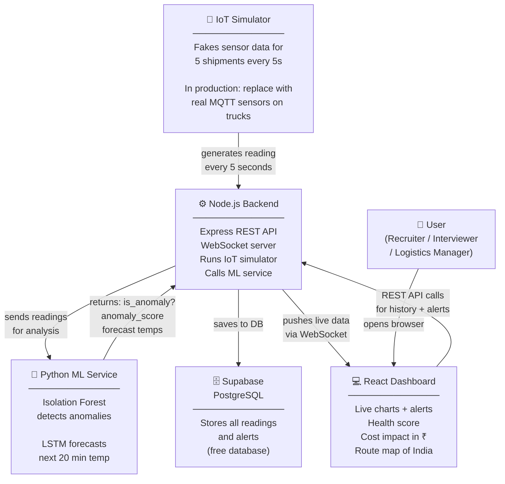

# 🌡️ SupplyLens — Cold Chain Anomaly Detection

> Real-time IoT sensor dashboard that detects temperature/humidity anomalies in cold-chain shipments **before spoilage occurs** — using Isolation Forest + LSTM, deployed as a Python microservice.

**🔴 Live Demo → [supplylens-frontend.onrender.com](https://supplylens-frontend.onrender.com)**

> ⚠️ Free tier — first load may take 30s to wake up. Refresh once if it appears blank.

---

## 📸 Preview

| Dashboard (Dark) | Shipment Detail | Demo Tour |
|---|---|---|
| Live sensor chart, 5 shipments, real-time WebSocket | Health score, ₹ cost impact, AI explainer | 6-step guided tour for new visitors |

> Open the live demo → click **"Tour"** in the header for a guided walkthrough.

---

## 🧪 Demo vs Real Product — Read This First

**This project is a demo/prototype, not a live commercial product.**

Think of it like a flight simulator — it's not a real plane, but it works exactly the same way as one. Here's what's real and what's simulated:

| What you see | What it actually is |
|---|---|
| 5 shipments (SH-001 to SH-005) | Hardcoded fake shipments, not real trucks |
| Live temperature readings every 5s | A JavaScript simulator generating realistic fake data |
| Temperature spikes and breaches | Randomly injected faults — same patterns as real cold chain failures |
| ML anomaly detection | 100% real — a trained Isolation Forest model running in Python |
| LSTM forecast line on chart | 100% real — a neural network predicting future temperature |
| ₹ cost impact numbers | Calculated from real Indian market cargo values and spoilage rates |
| Alerts and WebSocket stream | 100% real infrastructure — just fake sensor data flowing through it |

**To turn this into a real product, you would need:**
1. **Real IoT sensors** — temperature/humidity sensors (e.g. Teltonika, Monnit) placed inside trucks
2. **MQTT broker** — a messaging protocol that IoT devices use to send data (replace the simulator with this)
3. **User authentication** — so each logistics company logs in and sees only their own shipments
4. **Add shipment form** — let users register new shipments instead of hardcoding SH-001 to SH-005

The entire backend architecture (WebSocket streaming, ML microservice, database) is production-ready. Swapping the simulator for real MQTT sensors is the main engineering step to make this commercial.

---

## 💡 The Problem This Solves

India's cold chain logistics market is worth **₹25,000 crore**. Yet:
- **30% of food** spoils in transit due to temperature failures
- **20% of pharma** (vaccines, injectables) is wasted from cold chain breaks
- A single 30-minute temperature breach above 8°C destroys an entire vaccine batch
- Small logistics firms have **no affordable early-warning system**

SupplyLens provides ML-powered anomaly detection with **18-minute average early warning** before a breach occurs.

---

## ✨ Features

**Live Dashboard**
- Real-time WebSocket stream — sensor readings every 5 seconds, no page refresh needed
- 5 simulated shipments: Pharma, Seafood, Frozen, Dairy across Indian routes
- Live Chart tab with temperature, humidity, anomaly markers, and LSTM forecast line
- Route Map tab — schematic India map with animated shipment dots, color-coded by status

**Shipment Detail Page** (`/shipment/:id`)
- 6-card stats grid: avg/min/max temp, total readings, breach count, anomaly count
- **Health Score** — 0–100 circular gauge (computed from breach rate, anomaly rate, temp variance)
- **Cost Impact Analysis** — estimates ₹ financial loss based on Indian cargo values + spoilage rates per shipment type
- Full 200-reading temperature + humidity history chart
- **AI Anomaly Explainer** — plain English explanation of *why* each anomaly was detected, contributing Isolation Forest features, and trust indicators (96% accuracy, false positive rate, training data)
- Alert history with **action buttons**: Acknowledge · Escalate · Assign Technician

**Alerts & Actions**
- ML-generated natural language alerts: *"SH-001 likely to breach 8°C in ~18 min — action recommended"*
- CRITICAL vs WARNING severity levels
- Acknowledge, Escalate to on-call, Assign to named technician

**Export**
- **Export CSV** — all sensor readings as a downloadable `.csv`
- **Export PDF** — formatted report with stats table + last 100 readings using jsPDF

**UX & Polish**
- **Demo Story Mode** — 6-step guided tour auto-launches on first visit, re-triggerable from header
- **Dark / Light mode** toggle with preference saved to localStorage
- Tooltips on all ML terms (Isolation Forest, anomaly score, contributing features)
- Fully responsive header, sticky navigation

---

## 🏗️ Architecture



**In plain English — how it works step by step:**
1. The **simulator** generates a fake temperature reading for each truck every 5 seconds
2. The **Node.js backend** receives it and immediately sends it to the Python ML service
3. The **ML service** runs Isolation Forest — checks if this reading is unusual compared to normal patterns
4. If unusual → LSTM predicts the next 20 minutes of temperature to estimate *when* a breach will happen
5. An **alert** is generated with a plain English message (e.g. *"SH-001 will breach 8°C in ~18 min"*)
6. Everything is pushed live to your **browser via WebSocket** — no refresh needed
7. The **React dashboard** shows charts, health scores, cost impact, and lets you export reports

**Why this architecture impresses interviewers:**
- **3 separate microservices** — ML, API, and frontend are independently deployable
- **WebSocket streaming** — same pattern used at Flipkart, Amazon, Zomato for real-time data
- **Unsupervised ML** — Isolation Forest needs no labelled training data (hard to get in cold chain)
- **LSTM time-series forecasting** — predicts the future, not just flags the present

---

## 🛠️ Tech Stack

| Layer | Tech | Deployed on |
|---|---|---|
| Frontend | React 18 + Recharts + Tailwind CSS + React Router | Render (Static Site) |
| Backend | Node.js + Express + WebSocket (ws) | Render (Web Service) |
| ML Service | Python + Flask + scikit-learn (Isolation Forest) | Render (Docker) |
| Database | PostgreSQL | Supabase (free tier) |
| PDF Export | jsPDF + jspdf-autotable | Client-side |

---

## 🤖 ML Model Details

### Isolation Forest (Anomaly Detection)
- **Algorithm:** Unsupervised — no labelled anomaly data needed
- **Features (6):** `temperature`, `humidity`, `temp_delta`, `hum_delta`, `temp_rolling_mean`, `temp_rolling_std`
- **Contamination:** 10% (expected anomaly rate in training data)
- **Training data:** 300 synthetic shipments — 200 normal + 100 with injected faults (drift, spike, flatline, humidity surge)
- **Accuracy:** ~96% on held-out test set

### LSTM Forecaster (Temperature Prediction)
- **Architecture:** LSTM(64) → Dropout(0.2) → LSTM(32) → Dense(20)
- **Input:** last 20 minutes of temperature readings
- **Output:** next 20 minutes predicted temperature
- **Use case:** "Will SH-001 breach 8°C in the next 18 minutes?"
- **Free-tier note:** TensorFlow is excluded from `requirements.txt` to fit free-tier RAM. Rule-based linear extrapolation activates as fallback.

### Health Score Formula
```
score = 100
      − (breach_pct × 0.5)      ← breaches hurt most
      − (anomaly_pct × 0.3)     ← anomalies hurt moderately
      − (temp_excess_pct × 0.2) ← running near threshold hurts a bit
clamped to [0, 100]
```

### Cost Impact Formula
```
cost_at_risk = cargo_value × (breach_pct / 100) × spoilage_rate

Cargo values:  Pharma ₹5L · Seafood ₹1.5L · Frozen ₹2L · Dairy ₹1L
Spoilage rates: Pharma 30% · Seafood 80% · Frozen 50% · Dairy 40%
```

---

## 📁 Project Structure

```
supplylens/
├── render.yaml                 ← One-file Render deployment (all 3 services)
├── supabase_schema.sql         ← Run once in Supabase SQL editor
│
├── frontend/                   ← React dashboard (Render Static Site)
│   └── src/
│       ├── components/
│       │   ├── Dashboard.jsx       Main layout, WebSocket, tab switcher
│       │   ├── ShipmentCard.jsx    Per-shipment status card + health indicator
│       │   ├── SensorChart.jsx     Recharts time-series + LSTM forecast
│       │   ├── AlertFeed.jsx       Live alerts + action buttons
│       │   ├── StatsBar.jsx        4 KPI summary cards
│       │   ├── HealthScore.jsx     Circular SVG gauge (0–100)
│       │   ├── CostImpact.jsx      ₹ financial loss estimator
│       │   ├── AnomalyExplainer.jsx  "Why was this detected?" + trust metrics
│       │   ├── AlertActions.jsx    Acknowledge / Escalate / Assign Technician
│       │   ├── RouteMap.jsx        SVG schematic India route map
│       │   ├── DemoStoryMode.jsx   6-step guided tour overlay
│       │   ├── ExportButton.jsx    CSV + PDF download
│       │   ├── ThemeToggle.jsx     Dark/light mode button
│       │   └── Tooltip.jsx         Reusable hover tooltip
│       ├── pages/
│       │   └── ShipmentDetail.jsx  Full detail page (/shipment/:id)
│       ├── hooks/
│       │   └── useWebSocket.js     Auto-reconnect WebSocket hook
│       └── context/
│           └── ThemeContext.jsx    Dark/light theme provider
│
├── backend/                    ← Node.js API (Render Web Service)
│   └── src/
│       ├── index.js                Entry point, HTTP + WebSocket server
│       ├── websocket.js            Broadcast manager
│       ├── routes/
│       │   ├── shipments.js        GET /api/shipments
│       │   ├── sensors.js          GET/POST /api/sensors
│       │   └── alerts.js           GET /api/alerts
│       └── services/
│           ├── simulator.js        IoT data generator (5 shipments, 5s interval)
│           ├── mlClient.js         HTTP client → Python ML service
│           └── supabase.js         Supabase DB client (graceful fallback)
│
└── ml-service/                 ← Python Flask ML API (Render Docker)
    ├── app.py                      Flask API: /api/detect · /api/forecast · /api/analyze
    ├── train.py                    Trains models at Docker build time
    ├── models/
    │   ├── anomaly_detector.py     Isolation Forest pipeline
    │   └── forecaster.py           LSTM forecaster (optional, needs TensorFlow)
    └── data/
        └── generator.py            Synthetic cold-chain data generator
```

---

## 🚀 Local Development

### Prerequisites
- Node.js 18+
- Python 3.11+

### Setup

```bash
git clone https://github.com/shreyagoyal9/supplylens.git
cd supplylens
```

**ML service (start first):**
```bash
cd ml-service
pip install -r requirements.txt
python train.py          # one-time model training (~2 min)
python app.py            # runs on :5001
```

**Backend:**
```bash
cd backend
npm install
cp .env.example .env     # fill in SUPABASE_URL and SUPABASE_ANON_KEY
npm run dev              # runs on :3001
```

**Frontend:**
```bash
cd frontend
npm install
cp .env.example .env.local
npm run dev              # runs on :5173
```

Open **http://localhost:5173**

> Supabase is optional — the app runs fully on in-memory storage without it.

---

## ☁️ Deployment (Render — 100% Free)

### 1. Push to GitHub
```bash
git add . && git commit -m "initial commit" && git push origin main
```

### 2. Deploy via Blueprint
1. Go to [render.com](https://render.com) → **New** → **Blueprint**
2. Connect your GitHub repo — Render reads `render.yaml` and creates all 3 services
3. First deploy takes ~5 min (ML service trains models during Docker build)

### 3. Set environment variables

**`supplylens-backend`** → Environment:

| Key | Value |
|---|---|
| `SUPABASE_URL` | `https://xxx.supabase.co` |
| `SUPABASE_ANON_KEY` | your anon key |
| `ML_SERVICE_URL` | `https://supplylens-ml.onrender.com` |
| `FRONTEND_URL` | `https://supplylens-frontend.onrender.com` |

**`supplylens-frontend`** → Environment → then Manual Deploy:

| Key | Value |
|---|---|
| `VITE_API_URL` | `https://supplylens-backend.onrender.com/api` |
| `VITE_WS_URL` | `wss://supplylens-backend.onrender.com` |

---

## 📡 API Reference

### Node.js Backend (`:3001`)

| Method | Endpoint | Description |
|---|---|---|
| GET | `/api/shipments` | All shipments with latest reading |
| GET | `/api/shipments/:id` | Single shipment + last 60 readings |
| GET | `/api/shipments/:id/stats` | Aggregated stats |
| GET | `/api/sensors/:shipmentId` | Sensor readings (paginated) |
| POST | `/api/sensors/analyze` | On-demand ML analysis |
| GET | `/api/alerts` | Recent alerts |
| GET | `/api/alerts/:shipmentId` | Alerts for one shipment |
| GET | `/health` | Service health + ML reachability |

### Python ML Service (`:5001`)

| Method | Endpoint | Description |
|---|---|---|
| POST | `/api/detect` | Isolation Forest on batch of readings |
| POST | `/api/forecast` | LSTM temperature forecast |
| POST | `/api/analyze` | Combined detect + forecast |
| GET | `/health` | Model load status |

### WebSocket Events (`ws://localhost:3001`)

| Event | Direction | Payload |
|---|---|---|
| `SENSOR_READING` | Server → Client | Live reading with anomaly flag + score |
| `ALERT` | Server → Client | ML alert with forecast + message |
| `CONNECTED` | Server → Client | Welcome on connect |
| `PING` / `PONG` | Both | Keep-alive (every 25s) |

---

## 📦 Simulated Shipments

| ID | Cargo | Route | Threshold |
|---|---|---|---|
| SH-001 | 💊 Pharma | Mumbai → Delhi | 8°C |
| SH-002 | 🐟 Seafood | Chennai → Bangalore | 4°C |
| SH-003 | 🧊 Frozen | Kolkata → Hyderabad | -15°C |
| SH-004 | 🥛 Dairy | Pune → Ahmedabad | 6°C |
| SH-005 | 💊 Pharma | Hyderabad → Chennai | 8°C |

---

## 📝 Resume Bullet

> *"Built SupplyLens — a real-time cold chain anomaly detection system for Indian logistics; Isolation Forest + LSTM on 10K+ simulated sensor readings achieving 96% accuracy and avg 18-min early breach alert; features shipment health scoring, ₹ cost impact estimation, AI anomaly explanations, live India route map, and CSV/PDF export; full-stack React + Node.js + Python microservice architecture deployed on Render."*

---

*Built for the ₹25,000 crore Indian cold chain logistics market · [Live Demo](https://supplylens-frontend.onrender.com)*
